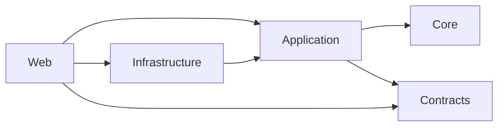

# Contacts Manager — ASP.NET Core MVC Clean Architecture Showcase

> A hands-on portfolio project built to master and demonstrate **enterprise-level .NET architecture patterns**: Clean Architecture, CQRS, Domain-Driven Design, the Result Pattern, comprehensive testing, and more.

---

## Table of Contents

- [About This Project](#-about-this-project)
- [Architecture Overview](#-architecture-overview)
- [Solution Structure](#-solution-structure)
- [Key Technical Patterns](#-key-technical-patterns)
- [Features](#-features)
- [Technology Stack](#-technology-stack)
- [Getting Started](#-getting-started)
- [Running Tests](#-running-tests)
- [Project Screenshots](#-project-screenshots)

---

## 🎯 About This Project

This project was built not just as a CRUD application, but as a **deliberate learning exercise** to practice writing production-quality .NET code following industry best practices.

The functional domain (contact management) is intentionally simple — it's the **internal architecture** that's the focus. Each layer, pattern, and design decision was chosen to reflect what you'd find in a real enterprise-grade codebase:

- Keeping business logic **framework-independent** (Clean Architecture)
- Separating reads from writes explicitly (CQRS)
- Eliminating exception-based control flow (Result Pattern)
- Making the system fully **testable at every layer** (Unit + Integration Tests)
- Using **authorization policies** with role-based access control

---

## 🏗️ Architecture Overview

The solution strictly follows the **Clean Architecture** dependency rule: outer layers depend on inner layers. The Domain (Core) has **zero** external package dependencies.

```
┌──────────────────────────────────────────────┐
│                  Presentation                │
│           ContactsManager.Web (MVC)          │
└─────────────────────┬───────────────┬────────┘
                      │               │
          ┌───────────▼───┐   ┌───────▼───────────┐
          │  Application  │   │  Infrastructure   │
          │ (CQRS/MediatR)│   │  (EF Core, Auth)  │
          └──────┬────────┘   └───────────────────┘
                 │
       ┌─────────▼──────────┐
       │    Core (Domain)    │
       │  (Zero Dependencies)│
       └────────────────────┘
          ▲           ▲
    ContactsManager  ContactsManager
      .Contracts      .Contracts
```

Dependency flow:


---

## 📂 Solution Structure

```
ContactsManager/
├── src/
│   ├── ContactsManager.Core/           # Domain layer (zero dependencies)
│   │   ├── Common/
│   │   │   ├── AuditableEntity.cs      # Base class for auditable entities
│   │   │   ├── Entity.cs               # Base entity with typed Id
│   │   │   └── Results/                # Result<T>, Error, ErrorKind types
│   │   ├── Persons/
│   │   │   ├── Person.cs               # Person aggregate root
│   │   │   └── PersonErrors.cs         # Typed domain error definitions
│   │   ├── Countries/
│   │   └── Identity/
│   │
│   ├── ContactsManager.Application/    # Application layer (use cases)
│   │   ├── Features/
│   │   │   ├── Persons/
│   │   │   │   ├── Commands/           # CreatePerson, UpdatePerson, RemovePerson
│   │   │   │   └── Queries/            # GetPersons, GetPersonById, GetFiltered,
│   │   │   │                           # GetPersonsCSV, GetPersonsExcel
│   │   │   ├── Countries/
│   │   │   └── Identity/
│   │   └── Common/
│   │       ├── Behaviors/
│   │       │   ├── ValidationBehavior.cs      # FluentValidation pipeline
│   │       │   └── UnhandledExceptionBehavior # Global exception catching
│   │       └── Interfaces/            # IAppDbContext, IPersonExportService, etc.
│   │
│   ├── ContactsManager.Infrastructure/ # Infrastructure layer
│   │   ├── Data/
│   │   │   ├── AppDbContext.cs
│   │   │   ├── Configurations/         # EF Core fluent configurations
│   │   │   └── Interceptors/           # AuditableEntityInterceptor
│   │   ├── Identity/                   # IdentityService implementation
│   │   ├── Services/
│   │   │   ├── PersonExportService.cs  # CSV + Excel export via EPPlus/CsvHelper
│   │   │   └── CountryImportService.cs # Bulk Excel import
│   │   └── DependencyInjection.cs
│   │
│   ├── ContactsManager.Contracts/      # Shared DTOs (Requests & Responses)
│   │
│   └── ContactsManager.Web/            # Presentation layer (MVC)
│       ├── Areas/Admin/                # Admin area with separate layout
│       ├── Controllers/                # Thin controllers delegating via MediatR
│       ├── Filters/ActionFilters/      # PersonsPostActionFilter
│       ├── Views/                      # Razor Views (Bootstrap 5)
│       └── StartupExtensions/          # Clean Program.cs via extension methods
│
└── Tests/
    ├── ContactsManager.UnitTests/      # Handler & Controller unit tests
    │   ├── Persons/Handlers/
    │   ├── Persons/Controllers/
    │   └── Persons/Filters/
    └── ContactsManager.IntegrationTests/  # Full E2E via WebApplicationFactory
        ├── CustomWebApplicationFactory.cs
        └── Persons/
```

---

## 🔑 Key Technical Patterns

### 1. Result Pattern — No Exception-Driven Control Flow

Instead of throwing exceptions for expected failure cases (e.g., "Person not found"), all application handlers return a `Result<T>`:

```csharp
// Core/Common/Results/Result.cs
public class Result<T>
{
    public bool IsSuccess { get; }
    public T? Value { get; }
    public Error? Error { get; }

    public static Result<T> Success(T value) => new(value);
    public static Result<T> Failure(Error error) => new(error);
}

// Core/Persons/PersonErrors.cs
public static class PersonErrors
{
    public static readonly Error NotFound =
        new(ErrorKind.NotFound, "Person.NotFound", "The requested person was not found.");
}
```

Controllers match on the result rather than catching exceptions:
```csharp
var result = await _mediator.Send(query);
return result.IsSuccess ? View(result.Value) : RedirectToErrorPage(result.Error);
```

---

### 2. CQRS with MediatR — Thin Controllers, Rich Handlers

Every use case is a self-contained handler. Controllers only dispatch commands/queries:

```
Features/Persons/
  Commands/
    CreatePerson/  → CreatePersonCommand + Validator + Handler
    UpdatePerson/  → UpdatePersonCommand + Validator + Handler
    RemovePerson/  → RemovePersonCommand + Handler
  Queries/
    GetPersons/               → Returns paged list
    GetPersonById/            → Returns single person
    GetFilteredAndSortedPersons/ → Search + sort + paging
    GetPersonsCSV/            → Returns CSV FileResult
    GetPersonsExcel/          → Returns .xlsx FileResult
```

---

### 3. MediatR Pipeline Behaviors

Two pipeline behaviors intercept every request before it reaches a handler:

| Behavior | Purpose |
|---|---|
| `ValidationBehavior<TRequest, TResponse>` | Runs FluentValidation validators, returns `Result.Failure` on errors |
| `UnhandledExceptionBehavior<TRequest, TResponse>` | Catches any unexpected exceptions and logs them safely |

---

### 4. Clean Architecture Dependency Rule

The dependency graph is strictly enforced:

| Layer | Allowed Dependencies |
|---|---|
| `Core` (Domain) | **None** — zero NuGet packages |
| `Application` | `Core`, `Contracts`, MediatR, FluentValidation |
| `Infrastructure` | `Application`, `Core`, EF Core, Identity, EPPlus, CsvHelper |
| `Web` | `Application`, `Infrastructure`, `Contracts` |

---

### 5. EF Core Auditable Entity Interceptor

Every entity that extends `AuditableEntity` (which has `CreatedAt` / `UpdatedAt` fields) automatically gets its timestamps set via a SaveChanges interceptor — no manual timestamp code in handlers.

---

### 6. Authorization Policies (RBAC)

Three authorization policies are defined globally in `Infrastructure/DependencyInjection.cs`:

| Policy | Requirement |
|---|---|
| `AdminOnly` | Requires `Admin` role |
| `UserOrAdmin` | Requires `User` or `Admin` role |
| Fallback | Any authenticated user (global) |

The Admin Area (`/Admin/Users`) is protected by `[Authorize(Policy = "AdminOnly")]`, giving admins the ability to promote/demote user roles.

---

## ✨ Features

- **Persons CRUD** — Full create, read, update, and delete with server-side + client-side validation
- **Filtering & Sorting** — Dynamic search by Name, Email, Gender, Country, Address with multi-column sorting
- **Data Export**
  - Export to **CSV** (via CsvHelper)
  - Export to **Excel (.xlsx)** (via EPPlus)
  - Export to **PDF** (via Rotativa)
- **Data Import** — Bulk-import Countries from an Excel file with row-by-row validation
- **Authentication** — Register/Login with ASP.NET Core Identity (cookie-based)
- **Admin Area** — Isolated MVC Area for user role management (`/Admin/Users`)
- **Structured Logging** — Serilog writing to Console, rolling file, SQL Server, and Seq
- **Custom Error Pages** — Status-code-specific error views (400, 403, 404, 500, etc.)

---

## 🛠️ Technology Stack

| Category | Technology |
|---|---|
| Framework | ASP.NET Core 10 MVC |
| ORM | Entity Framework Core 10 (SQL Server) |
| Mediator | MediatR |
| Validation | FluentValidation |
| Identity & Auth | ASP.NET Core Identity + Cookie Auth |
| Excel Export/Import | EPPlus |
| CSV Export | CsvHelper |
| PDF Export | Rotativa |
| Logging | Serilog (Console, File, MSSqlServer, Seq sinks) |
| UI | Bootstrap 5 + Bootstrap Icons + Outfit (Google Font) |
| Unit Testing | xUnit, Moq, AutoFixture, FluentAssertions |
| Integration Testing | Microsoft.AspNetCore.Mvc.Testing (WebApplicationFactory) |

---

## 🚀 Getting Started

### Prerequisites

- [.NET 10 SDK](https://dotnet.microsoft.com/download/dotnet/10.0)
- SQL Server (LocalDB is sufficient — ships with Visual Studio)
- *(Optional)* [Seq](https://datalust.co/seq) on `http://localhost:5341` for structured log visualization

### 1. Clone the Repository

```bash
git clone https://github.com/Adhamalkhateeb/Contacts-Manager-MVC.git
cd Contacts-Manager-MVC
```

### 2. Configure the Connection String

Update `src/ContactsManager.Web/appsettings.json`:

```json
{
  "ConnectionStrings": {
    "DefaultConnection": "Server=(localdb)\\MSSQLLocalDB;Database=ContactsManagerDb;Trusted_Connection=True;"
  }
}
```

### 3. Apply Database Migrations

```bash
dotnet ef database update \
  --project src/ContactsManager.Infrastructure \
  --startup-project src/ContactsManager.Web
```

### 4. Run the Application

```bash
dotnet run --project src/ContactsManager.Web
```

Open `https://localhost:7001` in your browser. Register a new account to get started.

> **First-run tip:** The first registered user will be a regular `User`. To access the Admin Area, manually set your role to `Admin` in the database, or use SQL Server Management Studio to insert the role assignment.

---

## 🧪 Running Tests

Testing was a core priority. The solution includes both fine-grained unit tests and full end-to-end integration tests.

**Current status: ✅ All 67 tests pass (0 failures)**

| Suite | Tests | Covers |
|---|---|---|
| `ContactsManager.UnitTests` | 64 | Handlers, Controllers, Action Filters |
| `ContactsManager.IntegrationTests` | 3 | Full HTTP pipeline with in-memory DB |

```bash
# Run the entire test suite
dotnet test

# Unit tests only (handlers, controllers, filters)
dotnet test Tests/ContactsManager.UnitTests

# Integration tests only (full HTTP request pipeline with in-memory DB)
dotnet test Tests/ContactsManager.IntegrationTests
```

### Test Setup Notes

- **Unit tests** use `Moq` to mock `IMediator` and application interfaces. `AutoFixture` generates test data to avoid brittle hardcoded values.
- **Integration tests** use a `CustomWebApplicationFactory<Program>` that replaces the SQL Server `DbContext` with an in-memory database and bypasses authentication for isolated, repeatable testing.

---

## 📄 License

This project is for learning and portfolio purposes. Feel free to use or reference any architectural patterns demonstrated here.

